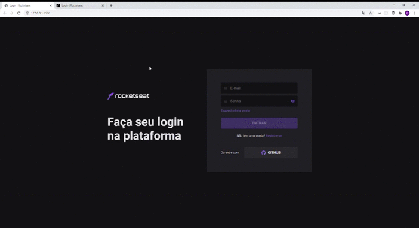

<p align="center">
  
  
  <a href="https://github.com/gabriel-savi/clone-pag-login-rocketseat/commits/master">
    
  </a>
  
  

  <a href="https://github.com/gabriel-savi">
    
  </a>
</p>

<h1 align="center">
  <br> 
</h1>

 ## 🏁 Tópicos

<p>
  👉<a href="#-sobre-o-projeto" style="text-decoration: none; "> Sobre</a> <br/>
  👉<a href="#-como-executar-o-projeto" style="text-decoration: none"> Como executar</a> <br/>
  👉<a href="#-tecnologias" style="text-decoration: none"> Tecnologias</a> <br/>
  👉<a href="#-autor" style="text-decoration: none"> Autor</a> <br/>
  👉<a href="#user-content--licença" style="text-decoration: none"> Licença</a>
</p>

## 💻 Sobre o projeto

O objetivo da aplicação desenvolvida é clonar o layout da tela de login da rocketseat, com a finalidade de praticar os conceitos aprendidos de HTML5 e CSS3 utilizando SASS.

## 🚀 Como executar o projeto

Este projeto contém apenas uma parte:

1. Frontend

### Pré-requisitos

Antes de começar, você vai precisar ter instalado em sua máquina a seguinte ferramenta:
[SASS](https://sass-lang.com/) <br>
Além disto é bom ter um editor para trabalhar com o código como [VSCode](https://code.visualstudio.com/)

#### 🧭 Rodando a aplicação web (Frontend)

```bash

# Clone este repositório
$ git clone https://github.com/gabriel-savi/clone-pag-login-rocketseat.git

# Acesse a pasta do projeto no seu terminal/cmd
$ cd clone-pag-login-rocketseat

# Iniciar o sass #
$ cd css
$ sass --watch style.scss:style.css

# Executar o arquivo index.html no navegador de preferência #

```

## 🛠 Tecnologias

As seguintes ferramentas foram usadas na construção do projeto:

HTML5 e CSS3 com SASS

#### **Utilitários**

- Editor: **[Visual Studio Code](https://code.visualstudio.com/)**

<a name="-autor"></a>

## 🦸‍♂️ **Autor**

<p>
<kbd>
 
 </kbd>
 <br />
 <sub><strong>🌟 Gabriel Savi 🌟</strong></sub>
</p>

[](https://www.linkedin.com/in/gabriel-antonio-savi-b4ab1816a/)
[](mailto:savi.gabriel@outlook.com)

---

## 📝 Licença

Este projeto esta sobe a licença [MIT](./LICENSE).

Feito com :satisfied: por Gabriel Savi 👋🏽 [Entre em contato!](https://www.linkedin.com/in/gabriel-antonio-savi-b4ab1816a/)

---
